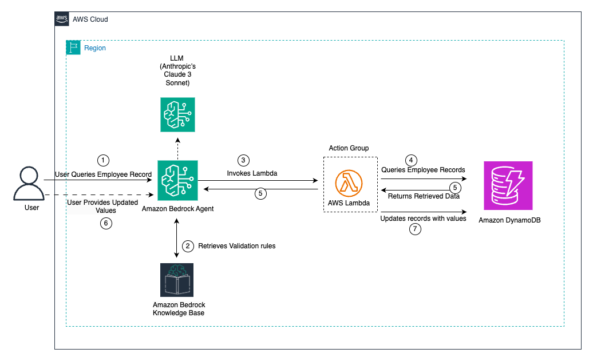

# AWS Bedrock Agent with DynamoDB Data Validation System

## Overview
This Terraform project creates an intelligent data validation system using AWS Bedrock Agent that can validate and suggest corrections for incomplete employee records stored in DynamoDB. The system leverages generative AI to provide intelligent recommendations based on validation rules stored in a knowledge base.

## Architecture

## Diagram

For a detailed visual representation of the system architecture, refer to the AWSGenAi diagram which illustrates the complete data flow and component interactions within the AWS Bedrock Agent system.





```
┌─────────────────────────────────────────────────────────────────────────────────┐
│                           AWS Bedrock Agent System                              │
└─────────────────────────────────────────────────────────────────────────────────┘

    ┌─────────────────┐         ┌─────────────────┐         ┌─────────────────┐
    │   User Query    │────────▶│  Bedrock Agent  │────────▶│   Lambda        │
    │                 │         │                 │         │   Function      │
    └─────────────────┘         └─────────────────┘         └─────────────────┘
                                         │                           │
                                         ▼                           ▼
                                ┌─────────────────┐         ┌─────────────────┐
                                │  Knowledge Base │         │    DynamoDB     │
                                │   (OpenSearch)  │         │ employee-records│
                                └─────────────────┘         └─────────────────┘
                                         │                           │
                                         ▼                           │
                                ┌─────────────────┐                  │
                                │   S3 Bucket     │                  │
                                │validation_rules │                  │
                                │     .json       │                  │
                                └─────────────────┘                  │
                                                                     │
                    ┌────────────────────────────────────────────────┘
                    │
                    ▼
            ┌─────────────────┐
            │  Sample Data:   │
            │  - Test (ID:    │
            │    1234, empty  │
            │    fields)      │
            │  - John Doe     │
            │    (complete)   │
            │  - Test123      │
            │    (partial)    │
            └─────────────────┘

┌─────────────────────────────────────────────────────────────────────────────────┐
│                              Data Flow                                          │
└─────────────────────────────────────────────────────────────────────────────────┘

1. User asks about incomplete employee records
2. Bedrock Agent processes the query
3. Agent consults Knowledge Base for validation rules
4. Lambda function queries DynamoDB for employee data
5. Agent provides intelligent suggestions based on validation patterns
6. System returns recommendations for missing/invalid data
```

## What This System Does

### Core Functionality
1. **Data Validation**: Validates employee records against predefined rules
2. **Intelligent Suggestions**: Uses AI to suggest valid values for empty fields
3. **Pattern Matching**: Enforces data patterns (e.g., Age: 18-100, Status: Active/Inactive/Pending)
4. **Knowledge-Based Responses**: Provides context-aware recommendations

### Sample Employee Data
The system includes sample employee records with various completion states:
- **Test** (ID: 1234) - Has missing Age, Status, and Surname fields
- **John Doe** (ID: 54321) - Complete record with all fields populated
- **Test123** - Has missing Age and ID fields but has Status and Surname

### Validation Rules
The system enforces these validation patterns:
- **Age**: Numeric, 18-100 years old
- **Surname**: Alphabetic characters only
- **ID**: Numeric, 1-1000 range
- **Status**: Must be "Active", "Inactive", or "Pending"

## Architecture Components

### AWS Services Used
- **AWS Bedrock Agent**: Orchestrates AI-powered conversations and actions
- **AWS Lambda**: Executes business logic for data operations
- **Amazon DynamoDB**: Stores employee records
- **Amazon OpenSearch**: Powers the knowledge base for validation rules
- **Amazon S3**: Stores validation rules and knowledge base documents
- **AWS IAM**: Manages permissions and access control

### Terraform Modules
```
main-modules/
├── main.tf              # Main infrastructure orchestration
├── variables.tf         # Input variables
├── outputs.tf          # Output values
├── provider.tf         # AWS provider configuration
└── terraform.tfvars    # Variable values

sub-modules/
├── 1-iam-roles/        # IAM roles and policies
├── 2-s3-bucket/        # S3 bucket for knowledge base
├── 3-dynamodb/         # DynamoDB table configuration
├── bedrock-agent/      # Bedrock Agent setup
├── knowledge_base/     # Knowledge base configuration
├── opensearch/         # OpenSearch collection
└── s3-upload/          # Upload validation rules to S3
```

## Prerequisites
- AWS CLI configured with appropriate credentials
- Terraform >= 1.0
- AWS account with Bedrock service access
- Permissions to create IAM roles, DynamoDB tables, S3 buckets, and OpenSearch collections

## Quick Start

1. **Clone and Navigate**:
```bash
git clone <repository-url>
cd terraform-dynamodb-genai-blog/main-modules
```

2. **Initialize Terraform**:
```bash
terraform init
```

3. **Review Configuration**:
```bash
terraform plan
```

4. **Deploy Infrastructure**:
```bash
terraform apply
```

## Configuration Variables

| Variable | Description | Default |
|----------|-------------|---------|
| `project_name` | Project identifier | `checkUpdateBlog` |
| `bucket_name` | S3 bucket suffix | `bedrock-agent-kb` |
| `kb_instructions_for_agent` | Agent instructions | Validation guidance |

## Usage Examples

Once deployed, you can interact with the Bedrock Agent to:

1. **Query incomplete records**:
   - "Show me employees with missing information"
   - "What fields are missing for employee ID 1234?"

2. **Get validation suggestions**:
   - "What are valid values for the Status field?"
   - "Help me complete the record for Test user"

3. **Validate data patterns**:
   - "Is age 150 valid for an employee?"
   - "What format should the ID field follow?"

## Resource Cleanup

To destroy all created resources:
```bash
terraform destroy
```

## Current Security Analysis

Your current setup has these security layers:
1. **Data Access Policy**: Restricts access to specific IAM principals (Bedrock service role, your account)
2. **Encryption Policy**: Uses AWS-owned keys for encryption at rest
3. **Network Policy**: Currently allows public access but this is controlled by the data access policy

## OpenSearch Serverless Public Access Justification

### Why OpenSearch Serverless is Currently Public

The OpenSearch Serverless collection is configured with `AllowFromPublic = true` in the network policy for the following architectural and operational reasons:

#### 1. **Multi-Service Integration Requirements**
- **AWS Bedrock Agent**: Needs to access the knowledge base from various AWS regions and availability zones
- **Knowledge Base Service**: Requires consistent access patterns across different AWS service endpoints
- **Cross-Service Communication**: Bedrock services operate from shared service infrastructure that benefits from public network access

#### 2. **Security Through Data Access Policies**
While the network policy allows public access, security is enforced through multiple layers:
- **Data Access Policy**: Explicitly restricts access to specific IAM principals:
  - Bedrock Knowledge Base service role
  - Your AWS account identity
  - AWS service role for Bedrock
  - Specific testing roles
- **IAM-Based Authentication**: All access requires valid AWS credentials and proper IAM permissions
- **Resource-Level Permissions**: Fine-grained permissions control what operations can be performed

#### 3. **AWS Service Architecture Compatibility**
- **Bedrock Agent Flexibility**: Allows the agent to access the knowledge base from different execution contexts
- **Serverless Nature**: OpenSearch Serverless is designed to work seamlessly with other AWS serverless services
- **Reduced Network Complexity**: Eliminates the need for complex VPC configurations and NAT gateways

#### 4. **Operational Benefits**
- **Simplified Troubleshooting**: Easier to diagnose connectivity issues without VPC networking complexity
- **Consistent Performance**: Avoids potential latency issues from VPC routing
- **Maintenance Overhead**: Reduces infrastructure management complexity

#### 5. **Risk Mitigation**
The public access is mitigated by:
```json
{
  "Principal": [
    "arn:aws:iam::ACCOUNT-ID:role/AmazonBedrockExecutionRoleForKB-*",
    "arn:aws:iam::ACCOUNT-ID:user/USERNAME",
    "arn:aws:iam::ACCOUNT-ID:role/aws-service-role/bedrock.amazonaws.com/AWSServiceRoleForAmazonBedrock"
  ]
}
```

**Note**: For production environments requiring additional network isolation, consider implementing VPC endpoints and private network policies, though this adds operational complexity and potential performance considerations.

## Lambda Function Error Handling

### Comprehensive Error Handling Implementation

The Lambda function includes robust error handling mechanisms designed to ensure reliable operation in production environments:

#### 1. **Exponential Backoff for Throttling**
```python
@handle_throttling
def get_item_with_retries(client, table_name, key, consistent_read=False):
```
- **Retry Logic**: Automatically retries failed requests up to 3 times
- **Exponential Backoff**: Uses increasing delays (100ms, 200ms, 400ms) between retries
- **Throttling Detection**: Specifically handles `ProvisionedThroughputExceededException`
- **Graceful Degradation**: Returns meaningful error messages when max retries exceeded

#### 2. **DynamoDB-Specific Error Handling**
```python
except ClientError as e:
    error_code = e.response['Error']['Code']
    if error_code == 'ResourceNotFoundException':
        print(f"Table {table_name} not found")
    elif error_code == 'ValidationException':
        print("Invalid parameter value")
```
- **Resource Not Found**: Handles missing tables or items gracefully
- **Validation Errors**: Catches and reports parameter validation issues
- **Conditional Check Failures**: Manages concurrent update conflicts

#### 3. **Concurrency Control**
```python
params['ConditionExpression'] = 'attribute_not_exists(#attr) OR #attr = :empty'
```
- **Optimistic Locking**: Prevents overwriting data that has been modified by another process
- **Conflict Detection**: Identifies when multiple users attempt to update the same field
- **User-Friendly Messages**: Returns clear error messages for concurrent update scenarios

#### 4. **Data Consistency Management**
```python
# Initial check uses eventually consistent reads for performance
response = get_item_with_retries(client, table_name, key, consistent_read=False)

# Verification uses strongly consistent reads for accuracy
verification = get_item_with_retries(client, table_name, key, consistent_read=True)
```
- **Performance Optimization**: Uses eventually consistent reads for initial queries
- **Data Accuracy**: Uses strongly consistent reads for critical operations
- **Verification Step**: Confirms updates were applied correctly

#### 5. **Input Validation and Sanitization**
```python
if not attribute_name or not attribute_value:
    raise ValueError("Missing attribute_name or attribute_value")
```
- **Required Field Validation**: Ensures all necessary parameters are provided
- **Type Checking**: Validates parameter types and formats
- **Sanitization**: Prevents injection attacks and malformed data

#### 6. **Comprehensive Logging**
```python
print(f"Input from agent: {event}")
print(f"DynamoDB response: {response}")
print(f"Error occurred: {str(e)}")
```
- **Request Tracking**: Logs all incoming requests for debugging
- **Response Monitoring**: Captures DynamoDB responses for analysis
- **Error Documentation**: Detailed error logging with context
- **CloudWatch Integration**: All logs automatically sent to CloudWatch for monitoring

#### 7. **Structured Error Responses**
```python
response_body = {
    'application/json': {
        'body': json.dumps({
            'status': 'ERROR',
            'message': f"Error updating value: {str(e)}"
        })
    }
}
```
- **Consistent Format**: All responses follow the same JSON structure
- **Status Indicators**: Clear success/error status for easy parsing
- **Descriptive Messages**: Human-readable error descriptions
- **Bedrock Agent Compatibility**: Formatted for optimal agent interpretation

#### 8. **Resource Management**
- **Connection Reuse**: Boto3 client reused across function invocations
- **Memory Optimization**: Efficient handling of DynamoDB responses
- **Timeout Handling**: Graceful handling of service timeouts
- **Resource Cleanup**: Proper cleanup of resources and connections

This error handling approach ensures the system remains stable and provides meaningful feedback even when encountering various failure scenarios, making it suitable for production workloads.

## Security Considerations
- IAM roles follow least privilege principle
- S3 buckets are configured with appropriate access controls
- DynamoDB table uses encryption at rest
- OpenSearch collection has proper security configurations

## Security Recommendations
- **AWS Customer Managed Keys (CMK)**: For enhanced security in production environments, consider implementing AWS KMS Customer Managed Keys (CMK) to encrypt AWS resources instead of AWS-owned keys. This provides:
  - Full control over key rotation policies
  - Detailed audit trails through CloudTrail
  - Ability to disable or delete keys when needed
  - Cross-account access control for shared resources
  - Compliance with regulatory requirements that mandate customer-controlled encryption

## Operational Recommendations

### Lambda Periodic Scan Implementation
For production environments, consider implementing a periodic scan mechanism to proactively identify and address data quality issues:

#### **Recommended Implementation**
- **Scheduled Lambda Function**: Create a separate Lambda function that runs on a CloudWatch Events schedule (e.g., daily or weekly)
- **DynamoDB Scan Operations**: Systematically scan the employee records table to identify incomplete or invalid data
- **Automated Reporting**: Generate reports of data quality issues and send notifications via SNS or SES
- **Integration with Bedrock Agent**: Optionally trigger the Bedrock Agent to provide suggestions for identified issues

#### **Benefits of Periodic Scanning**
- **Proactive Data Quality**: Identify issues before they impact business operations
- **Compliance Monitoring**: Ensure data completeness meets organizational standards
- **Trend Analysis**: Track data quality improvements over time
- **Automated Remediation**: Trigger workflows to address common data issues

#### **Implementation Considerations**
```python
# Example periodic scan structure
def periodic_scan_handler(event, context):
    # Scan DynamoDB table for incomplete records
    # Generate data quality report
    # Send notifications for critical issues
    # Optionally trigger Bedrock Agent for suggestions
```

#### **Scheduling Options**
- **Daily Scans**: For high-frequency data updates
- **Weekly Scans**: For stable datasets with occasional updates
- **Event-Driven**: Triggered by data modification events
- **Custom Intervals**: Based on business requirements and data volatility

#### **Cost Optimization**
- Use DynamoDB's parallel scan feature for large tables
- Implement pagination to avoid Lambda timeout issues
- Consider using DynamoDB Streams for real-time data quality monitoring
- Optimize scan filters to reduce read capacity consumption

This periodic scanning approach complements the reactive validation provided by the Bedrock Agent, creating a comprehensive data quality management system.

## Cost Optimization
- Uses on-demand pricing for DynamoDB
- S3 storage optimized for infrequent access patterns
- Lambda functions configured with appropriate memory allocation
- OpenSearch collection sized for development workloads

## Troubleshooting

### Common Issues
1. **Bedrock Access**: Ensure your AWS account has access to Bedrock services
2. **Region Availability**: Bedrock Agent may not be available in all regions
3. **IAM Permissions**: Verify all required permissions are granted

### Monitoring
- CloudWatch logs for Lambda function execution
- Bedrock Agent conversation logs
- DynamoDB metrics for table operations

## Contributing
1. Fork the repository
2. Create a feature branch
3. Make your changes
4. Test thoroughly
5. Submit a pull request

## License
This project is licensed under the MIT License - see the LICENSE file for details.
